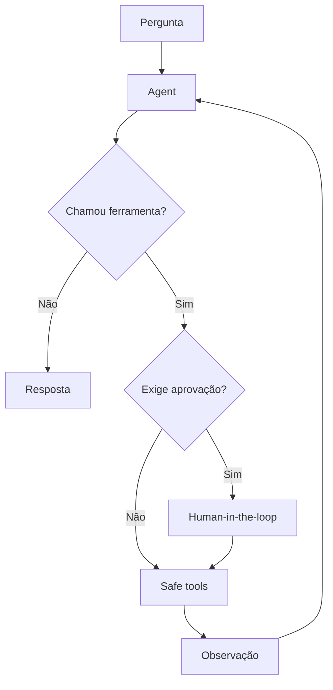

# LangGraph Tool Agent

[](https://github.com/viniciusds2020/langgraph-tool-agent/actions/workflows/quality.yml)
[](https://docs.langchain.com/oss/python/langgraph/)
[](https://console.groq.com/docs/)
[](https://fastapi.tiangolo.com/)

Agente stateful para resolução de problemas com ferramentas seguras. O LangGraph controla planejamento, tool calling, observações, repetição, checkpoints e aprovação humana.

## O que demonstra

- agente ReAct baseado em grafo;
- estado tipado com mensagens, iterações e rastros;
- tool calling com Groq/Llama;
- checkpoints isolados por `thread_id`;
- pausa e retomada com `interrupt()` e `Command(resume=...)`;
- allowlist de ferramentas;
- limite de oito ciclos;
- execução simulada sem chave ou tokens;
- interface que mostra decisões operacionais sem expor pensamento interno;
- histórico, latência e tokens em SQLite.

## Grafo



## Ferramentas

| Ferramenta | Função | Proteção |
|---|---|---|
| `calculator` | expressões aritméticas | parser AST, sem `eval` |
| `calendar_now` | data/hora por timezone | somente IANA ZoneInfo |
| `csv_profiler` | qualidade e estatísticas | dataset cadastrado, limite de tamanho |
| `read_business_database` | métricas de negócio | SELECT único, tabela permitida e aprovação |
| `search_agent_knowledge` | boas práticas locais | base fechada e somente leitura |

## Instalação

```bash
git clone https://github.com/viniciusds2020/langgraph-tool-agent.git
cd langgraph-tool-agent
python -m venv .venv
source .venv/bin/activate
pip install -e ".[dev]"
cp .env.example .env
langgraph-tool-agent
```

Acesse:

- interface: http://localhost:8000
- Swagger: http://localhost:8000/docs
- health check: http://localhost:8000/health

## Modos

### Simulação

Funciona sem chave, chama implementações locais determinísticas, registra evidências e não consome tokens.

### Groq ao vivo

```env
GROQ_API_KEY=gsk_...
GROQ_MODEL=llama-3.3-70b-versatile
```

O modelo decide quando chamar as ferramentas. A política do grafo, e não o LLM, decide quais ferramentas são permitidas e quando uma aprovação é obrigatória.

## Exemplos

- `Calcule 128 * 37`
- `Qual a data e hora de hoje?`
- `Analise o dataset #1`
- `Busque práticas para aprovação humana em agentes`
- `Consulte a receita mensal na tabela business_metrics` — modo live com aprovação

## API

| Método | Endpoint | Finalidade |
|---|---|---|
| POST | `/api/agent/run` | iniciar ou continuar uma thread |
| POST | `/api/agent/{thread_id}/resume` | aprovar ou negar ferramenta |
| GET | `/api/capabilities` | ferramentas e modo |
| GET/POST | `/api/datasets` | catálogo de CSVs |
| GET | `/api/runs` | histórico e métricas |

## Docker

```bash
docker compose up --build
```

## Testes

```bash
ruff check src tests
pytest --cov=tool_agent
```

Os testes não realizam chamadas à Groq.

## Segurança

- não usa `eval` ou execução de código;
- não aceita comandos shell;
- SQL limitado a um único `SELECT` em tabela permitida;
- ferramentas governadas exigem aprovação;
- arquivos ficam fora do Git;
- prompts tratam contexto como dado não confiável;
- falhas de ferramentas retornam observações controladas.

## Roadmap

- [ ] checkpointer SQLite ou PostgreSQL;
- [ ] streaming de eventos via SSE;
- [ ] ferramentas MCP com allowlist;
- [ ] timeout e circuit breaker por ferramenta;
- [ ] autenticação e RBAC;
- [ ] avaliação determinística por tipo de tarefa;
- [ ] sandbox externo para execução de código;
- [ ] integração com AI Automation Hub.

## Referências

- [LangGraph Graph API](https://docs.langchain.com/oss/python/langgraph/use-graph-api)
- [LangGraph Persistence](https://docs.langchain.com/oss/python/langgraph/persistence)
- [LangGraph Interrupts](https://docs.langchain.com/oss/python/langgraph/interrupts)
- [Groq Text Generation](https://console.groq.com/docs/text-chat)

## Autor

Desenvolvido por [Vinicius de Sousa](https://github.com/viniciusds2020).

